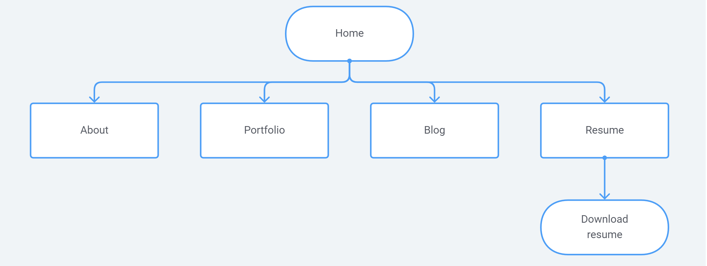
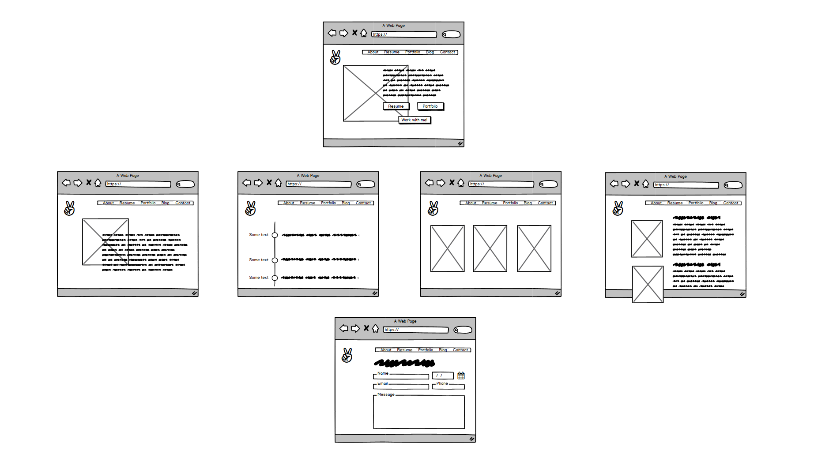

# Portfolio Website

**URL**

https://wendycodeworks.github.io/portfolio-site/

**GitHub Repo**

https://github.com/wendycodeworks/portfolio-site

## Purpose

Websites can showcase a coder's experience as well as aptitude. As with any portfolio, projects are essential to demonstrate skill and provide an alternative to a GitHub repository. 

This portfolio website works to simplify the message, focusing on succinct communication without compromising too much detail about the coder. While this is intended to be a professional website, I wanted to inject some playfulness and a little personality into the design. I also wanted to draw attention to important information, without bombarding the visitor with excessive colours and graphics. The essentialist approach to the design is also a reflection with how I work and what the visitor can anticipate from me when they engage my services.

## Features

### 1. Navigation

Navigation has been kept simple and intuitive with a horizontal navigation bar in the header. 

### 2. Footer

The footer allows the visitor access to social media links on any page.

### 3. Blog and project cards

The blog and project cards capture an image and minimal text.

### 4. Resume download

Visitors can also download the PDF version of a resume from the navigation bar.

### Responsive web design

The website can be viewed on a mobile device without distortion of the components and elements. A combination of flexbox and media queries makes it possible to view the website on various mobile screen sizes. Viewing the website on a tablet device will display the web page.

### Semantic HTML

Semantic HTML helps both browser and developer identify the purpose of an element. It indicates what type of information will be populated. This is particularly important for visually impaired visitors who make use of screen readers. 

### Subresource integrity (SRI)

The website makes use of Content Delivery Networks (CDNs) for fonts and icons. Using CDNs does come at a risk. Malicious content can be injected into a CDN in the case of an attack. Applying SRI adds a basic layer of security.

## Sitemap & wireframes

### Sitemap

### Wireframes

The actual website deviated significantly from the wireframes. During the development process it became clear that information can be succinctly communicated through fewer elements. 

## Screenshots

## Target audience

* Potential employers 
* Future clients
  * Creative startups
  * Tech startups
  * SME professional services firms

## Tech stack

Webpages written in HTML & CSS

Deployed on GitPages

