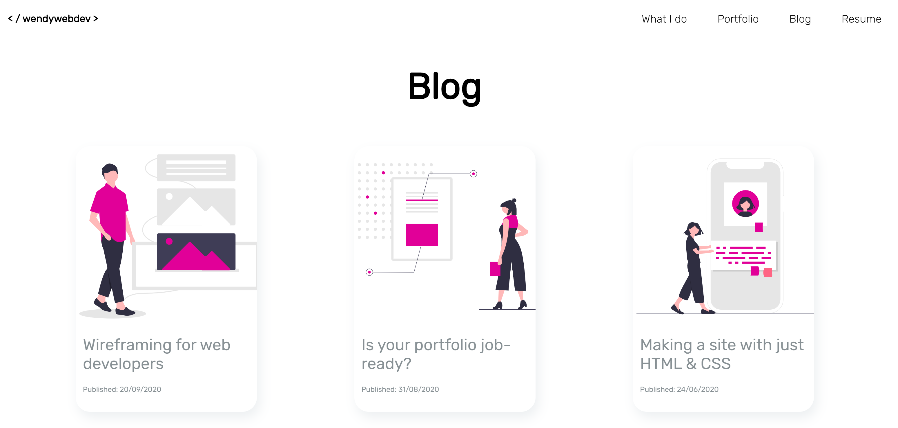

# Portfolio Website

**URL**

https://wendycodeworks.github.io/portfolio-site/

**GitHub Repo**

https://github.com/wendycodeworks/portfolio-site

## Purpose

Websites can showcase a coder's experience as well as aptitude. As with any portfolio, projects are essential to demonstrate skill and provide an alternative to a GitHub repository. 

This portfolio website works to simplify the message, focusing on succinct communication without compromising too much detail about the coder. While this is intended to be a professional website, I wanted to inject some playfulness and a little personality into the design. I also wanted to draw attention to important information, without bombarding the visitor with excessive colours and graphics. The essentialist approach to the design is also a reflection with how I work and what the visitor can anticipate from me when they engage my services.

## Features

###### Navigation

###### Footer bar	

###### Style

###### Responsive design

###### Semantic HTML

###### Social media links

###### Subresource integrity

## Sitemap

## Screenshots

## Target audience

## Tech stack

HTML

CSS

GitPages